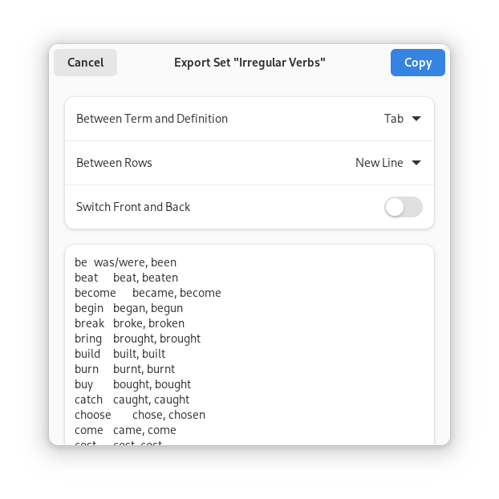

  
  <h1 align="center">Memorize</h1>

_Memorize_ is a native GNOME app that stores your flashcard sets.
It enables you to create, edit, view, and study sets.
Use the test mode to create preparation exams.
Additionally, you can easily import existing Quizlet sets.

## Table of Contents

- [Installation](#Installation)
- [Usage](#Usage)
- [Localization](#Localization)
- [Thanks](#Thanks)

## Installation

The preferred way to install the Memorize app is via Flathub.

### Build Flatpak Locally

You can also build the app yourself, e.g. to modify the source code.

1. Download this repository's source code and open the folder using [GNOME Builder](https://apps.gnome.org/Builder/).
2. Build and run the project using the run button.
3. Next to the hammer icon, in the dropdown menu, select `Export` and wait for the file browser to appear.
4. Open the `.flatpak` file with [GNOME Software](https://apps.gnome.org/Software/) and install the app.

## Usage

Create a new set using the `+` button in the sidebar. Click the pen icon to edit the set's title
and content, or to delete the set.

### Import

If you have a Quizlet set you'd like to use, click the download icon next to `Add Flashcard`.
Follow the tutorial [here](data/tutorials/Import.mp4).

### Study

The study mode follows a simple principle: each flashcard starts with the same initial difficulty value.
The cards will be presented in a random order. Type in the answer and press enter.
If correct, the difficulty score decreases, otherwise, it increases by one.
Cards with a score of zero won't appear again in this round.
You can restart the study mode at any time.

### Test

A test is one page containing a specified number of random flashcards.
Type in your answers and scroll down to correct and see your score. Correct your mistakes.

### Export

In the toolbar of the view for editing a set, find the button with a sharing icon in order to export the set.

## Localization

Translations are welcome! You can either edit the [Localized.yml file](Sources/Model/Localized.yml) directly as YAML,
or install the [Localizer](https://github.com/AparokshaUI/Localizer) app and translate with a UI.

Either way, commit the changes via git and open a pull request.

## Thanks

### Dependencies
- [FuzzyFind](https://github.com/truizlop/FuzzyFind) licensed under the [Apache License, Version 2.0](https://github.com/truizlop/FuzzyFind/blob/main/LICENSE.md)
- [Adwaita](https://github.com/AparokshaUI/Adwaita) licensed under the [MIT License](https://github.com/AparokshaUI/Adwaita/blob/main/LICENSE.md)
- [Localized](https://github.com/AparokshaUI/Localized) licensed under the [MIT License](https://github.com/AparokshaUI/Localized/blob/master/LICENSE.md)

### Other Thanks
- The [contributors](Contributors.md)
- [SwiftLint](https://github.com/realm/SwiftLint) for checking whether code style conventions are violated
- The programming language [Swift](https://github.com/apple/swift)
- [Libadwaita](https://gnome.pages.gitlab.gnome.org/libadwaita/doc/1.4/) and [GTK](https://docs.gtk.org/gtk4/) for the UI widgets
- [GNOME Builder](https://apps.gnome.org/Builder/) and many other apps
