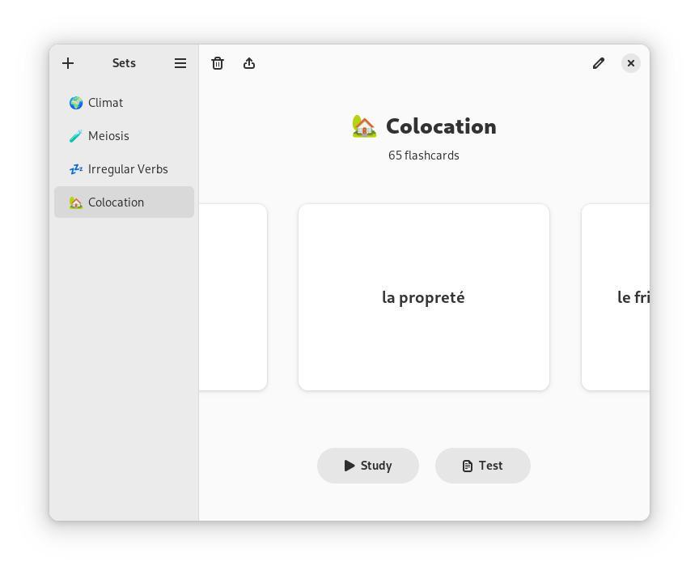
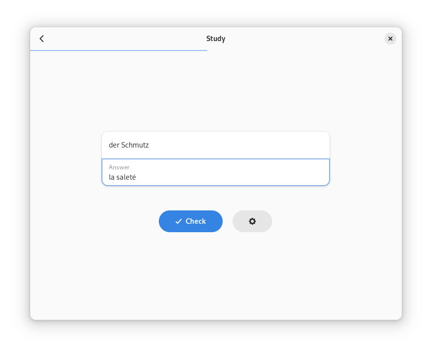
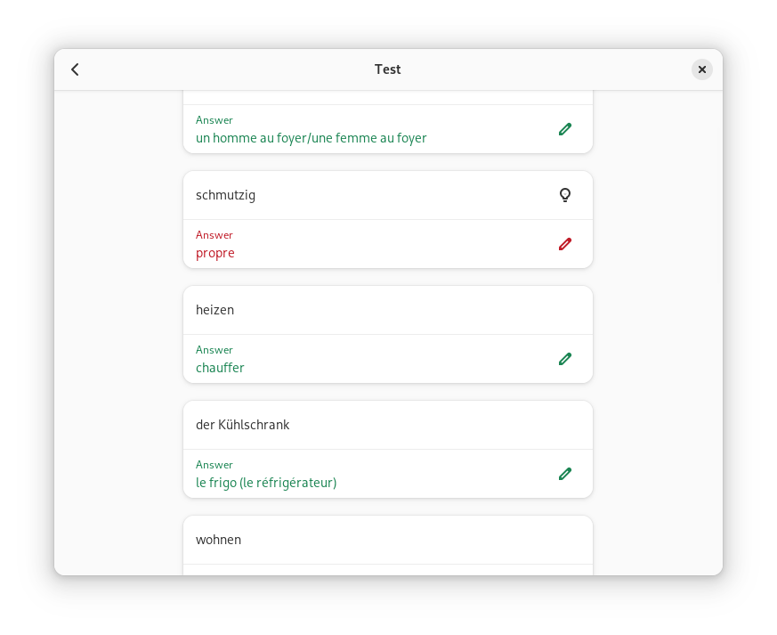

  
  <h1 align="center">Flashcards</h1>

_Flashcards_ is a native GNOME app that stores your flashcard sets.
It enables you to create, edit, view, and study sets.
Use the test mode for creating a preparation exam.
You can easily import existing Quizlet sets.

## Table of Contents

- [Installation](#Installation)
- [Usage](#Usage)
- [Thanks](#Thanks)

## Installation

1. Follow the installation instructions [here](https://github.com/AparokshaUI/AdwaitaTemplate#install-the-swift-freedesktop-sdk-extension).
2. Download this repository's source code and open the folder using [GNOME Builder](https://apps.gnome.org/Builder/).
3. Next to the hammer icon, in the dropdown menu, select `Export` and wait for the file browser to appear.
4. Open the `.flatpak` file with [GNOME Software](https://apps.gnome.org/Software/) and install the app.

## Usage

Create a new set using the `+` button in the sidebar. Press on the pen icon in order to edit the set's title
and content, or to delete the set.

Click on the button with the download icon next to `Add Flashcard` if you want to import a Quizlet set.
Follow the tutorial [here](data/tutorials/Import.mp4).

The study mode follows a simple principle: each flashcard starts with the same initial difficulty value.
The cards will be presented in a random order. Type in the answer and press enter.
If your answer is right, the difficulty score decreases, otherwise, it increases by one.
When a card reaches the score of zero, it won't appear in this round anymore.
You can always restart the study mode.

A test is one page containing a specified number of random flashcards.
Type in your answers and scroll down to correct and see your score. Correct your mistakes.

## Thanks

### Dependencies
- [Adwaita](https://github.com/AparokshaUI/Adwaita) licensed under the [GPL-3.0 license](https://github.com/AparokshaUI/Adwaita/blob/main/LICENSE.md)

### Other Thanks
- The [contributors](Contributors.md)
- [SwiftLint](https://github.com/realm/SwiftLint) for checking whether code style conventions are violated
- The programming language [Swift](https://github.com/apple/swift)
- [Libadwaita](https://gnome.pages.gitlab.gnome.org/libadwaita/doc/1.4/) and [GTK](https://docs.gtk.org/gtk4/) for the UI widgets
- [GNOME Builder](https://apps.gnome.org/Builder/) and many other apps
